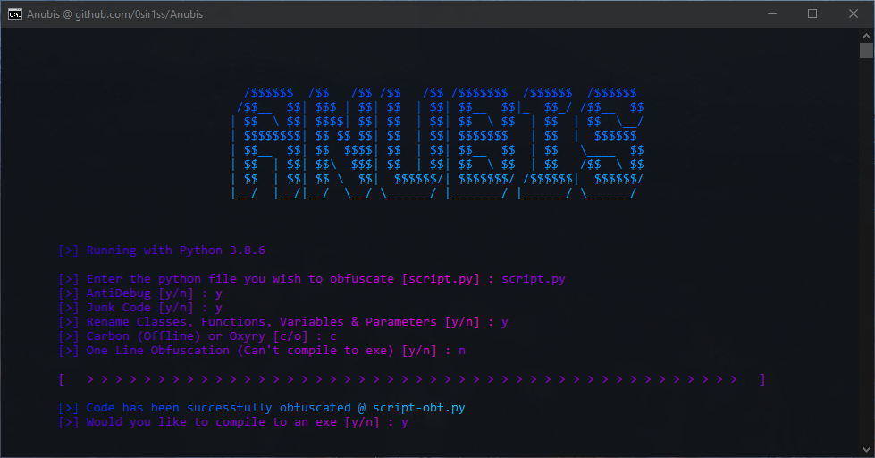

<div align="center" id="top"> 
  

  &#xa0;

</div>

<h1 align="center">Anubis</h1>

<p align="center">
  

  

  

  <!--  -->

  <!--  -->
  
  <!--  -->
  
  <!--  -->

</p>


<p align="center">
  <a href="#dart-about">About</a> &#xa0; | &#xa0; 
  <a href="#sparkles-features">Features</a> &#xa0; | &#xa0;
  <a href="#rocket-technologies">Technologies</a> &#xa0; | &#xa0;
  <a href="#white_check_mark-requirements">Requirements</a> &#xa0; | &#xa0;
  <a href="#checkered_flag-starting">Starting</a> &#xa0; | &#xa0;
  <a href="#memo-license">License</a> &#xa0; | &#xa0;
  <a href="https://github.com/0sir1ss" target="_blank">Author</a>
</p>

<br>

## :dart: About ##

I was looking around online and github when I realised that there were little Python obfuscators. First there's [pyarmor](https://pypi.org/project/pyarmor/) but that can be deobfuscated, however it still is quite good. Then there's many tools like [pyminifier](https://pypi.org/project/pyminifier/) but they all do the same thing and don't provide any real protection against your code. Another good solution I found was this obfuscator [here](https://pyob.oxyry.com/) but purchasing it costs **USD $1998**. Luckily I made my own version named [Carbon](https://github.com/0sir1ss/Carbon) which you can use for free.

Anyways, I decided to create my own obfuscator, which provides a plethora of features such as junk code and custom encryption, and includes the obfuscation found in Carbon.

You can see the difference it makes from this source [here](https://github.com/0sir1ss/Anubis/blob/main/example/script.py) to this obfuscated one liner [here](https://github.com/0sir1ss/Anubis/blob/main/example/script-obf.py) and you can see what Carbon does [here](https://github.com/0sir1ss/Carbon/blob/main/examples/script-obf.py)

## :sparkles: Features ##

:heavy_check_mark: Anti Debugger - Stop the use of debuggers whilst this program is running\
:heavy_check_mark: Junk Code - Add junk code to the program\
:heavy_check_mark: Carbon Obfuscation - Rename classes, functions, variables and parameters along with removing comments and docstrings\
:heavy_check_mark: Custom Encryption - A one liner which uses custom encryption\
:heavy_check_mark: Compile to exe with Nuitka

## :rocket: Technologies ##

The following tools were used in this project:

- [Python](https://www.python.org/)
- [Nuitka](https://pypi.org/project/Nuitka/)

## :white_check_mark: Requirements ##

Before starting, you need to have [Python](https://www.python.org/) installed.

If you wish to compile your project to an exe you will need [Nuitka](https://pypi.org/project/Nuitka/) along with a C compiler. Nuitka will automatically download the MinGW64 compiler if no usable one is found.

## :checkered_flag: Starting ##

```bash
# Clone this project
$ git clone https://github.com/0sir1ss/Anubis

# Access
$ cd Anubis

# Install dependencies
$ pip install -r requirements.txt

# Run the project
$ python anubis.py
```

If you do not compile to an exe and instead choose to distribute with the custom encryption you will need the [ancrypt file](https://github.com/0sir1ss/Anubis/blob/main/ancrypt.py)\
You can build this with the following command:
> python setup.py build_ext --inplace

## :memo: License ##

This project is under license from MIT. For more details, see the [LICENSE](LICENSE) file.


Made with :heart: by <a href="https://github.com/0sir1ss" target="_blank">0sir1s</a>

&#xa0;

<a href="#top">Back to top</a>
